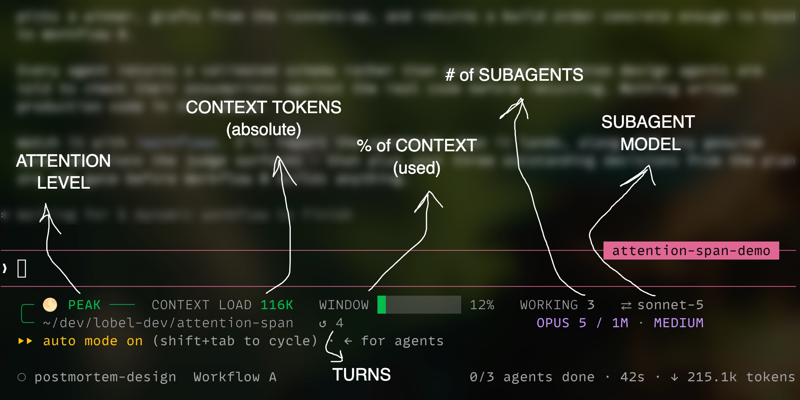

# Attention Span

[](LICENSE)

> Your model's attention span is shorter than its context window.

A Claude Code status line that tells you when to step in.

It gives you one attention indicator at a time, guiding you to engineer around the physical and economic limitations of the model's context window.



## Why use this one?

Most status lines are dashboards. This one is narrowly focused on deciding whether to keep a session going or intervene.

It is not the most capable general status line:

- Want themes, widgets, git details, costs, tasks, and rich agent views? Try
  [YAS](https://github.com/tmck-code/yet-another-statusline),
  [ccstatusline](https://github.com/sirmalloc/ccstatusline), or
  [Claude HUD](https://github.com/jarrodwatts/claude-hud).
- Want a more minimal conventional model, context, and usage bar? Try
  [kcchien's statusline](https://github.com/kcchien/claude-code-statusline) or
  [nilbuild's statusline](https://github.com/nilbuild/claude-statusline).
- Want usage tracking? I highly recommend
  [ClaudeBar](https://github.com/tddworks/ClaudeBar).
- Want one recommended action based on effective context, session history, and
  subagent activity? That is what Attention Span is built for.

The deeper reason it exists: agentic sessions fail silently. Anthropic's own
postmortem of an April 2026 incident described a prompt-caching optimization bug
that quietly made sessions dumber while draining usage limits faster than
expected. Nothing inside a session announces degradation like that; users were
left diagnosing it by vibes.

So this tool goes beyond token counts and reads the transcript for the
signatures of failures that are invisible in the moment:

- A failed file edit followed by another edit to the same file with no re-read -
  the clearest sign Claude is retrying blind. The same check runs on every
  subagent.
- The cache signature of that April 2026 incident - a sustained drop in cache
  hits with constant re-creation - surfaced as `CHECK CACHE - COST RISING`.
- A session history it cannot read reliably, in which case it refuses to say
  `PEAK` rather than guess.

## Quick start

Requires Claude Code, Python 3.11+, and Bash on macOS or Linux.

```sh
curl -fsSL https://raw.githubusercontent.com/lobel-dev/attention-span/main/install.sh | bash
```

Or from a clone, if you prefer to read what you run first:

```sh
git clone https://github.com/lobel-dev/attention-span.git
cd attention-span
bash install.sh
```

Open a new Claude Code session. The status line appears at the bottom.

The installer stages a versioned copy under `~/.claude/hooks/attention-span/`
and points Claude Code's `statusLine` setting at it. It saves whatever it
replaces, so uninstall restores your previous setup. Installed copies check
GitHub at most once a day for a newer verified release and update themselves;
set `CLAUDE_HEALTH_AUTO_UPDATE=0` to opt out.

## The display

Row 1 is the action plus a few live facts. Row 2 is the working folder, lines
changed, turns taken, model, context-window size, and effort level. The `+N/-N`
counter is the session's cumulative edits as reported by Claude Code - it only
grows, and committing does not reset it; it answers "how much has this session
churned?", not "what is uncommitted?". The `↺ N` counter is the session's turn
count - one turn being a prompt from you plus the model's response to it.
A `⚡` before the model name means fast mode is on.

| Label | Meaning |
|---|---|
| `CONTEXT LOAD` | Context tokens (absolute) - the one number the health grade reads. |
| `WINDOW` | Share of the advertised context window in use. Shown, never graded. |
| `WORKING` | Subagents working right now. Hidden when there are none. |

## Context health

Context is graded on one number, the absolute context load in tokens - on the ladder for the model's advertised window class. A 200K-window model gets a tighter ladder than a 1M one, because degradation is front-loaded: the same token count can read as calm on one model and past the effective ceiling on another. That difference is the point of the tool, not a bug.

| | Status | 1M / unknown window | 200K window | What it means |
|---|---|---|---|---|
| `🌕` | `PEAK` | < 32K | < 32K | Full working room. |
| `🌖` | `STILL SHARP` | ≥ 32K and < 128K | ≥ 32K and < 80K | Comfortable. Nothing to do. |
| `🌗` | `FUNCTIONAL` | ≥ 128K and < 200K | ≥ 80K and < 128K | Finish the current step, then compact or handoff. |
| `🌘` | `DEGRADING` | ≥ 200K and < 300K | ≥ 128K and < 160K | Compact or handoff before starting anything else. |
| `🌑` | `FAILING` | ≥ 300K and < 600K | ≥ 160K and < 192K | Audit what you are getting back. Compact or handoff. |
| `💀` | `DEAD` | ≥ 600K | ≥ 192K | Model attention heavily diluted. Start a fresh session. |

The row says the tier, not what to do about it: one word plus the heat bar beside it, because a status line is not a dictator. The point of the ladder is to get you to compact or handoff at a logical **breakpoint** - the end of a step or milestone, a moment you chose - rather than wherever the window happens to force an automatic compaction mid-task. `FUNCTIONAL` arrives early enough to finish the current step first, because a compaction at a boundary loses bookkeeping, while one mid-implementation loses the working state you need most.

Every boundary is a small-sample calibrated default chosen by the project owner - a workflow trigger, not a measured point where quality is guaranteed to fail. Symptoms beat the number: if Claude starts repeating settled questions, dropping requirements, re-reading files, or contradicting earlier work, act on instinct with the tier as your guide.

## What it can say

| Status | What it means |
|---|---|
| `PEAK` | None of the checks needs attention. |
| `STILL SHARP` | The context remains comfortable. Nothing to do. |
| `FUNCTIONAL` | Finish the current step, then compact or handoff. |
| `DEGRADING` | Compact or handoff before starting anything else. |
| `FAILING` | Audit what you are getting back; compact or handoff. |
| `DEAD` | Start a fresh session. |
| `COMPACT COMPLETE` | Compaction succeeded; the context reading returns next turn. |
| `N SUBAGENTS FINISHED` | That many subagents just completed; any still working are counted beside it. |
| `READ FILE, THEN RETRY` | A file edit failed, and Claude tried that file again without reading it. |
| `CHECK CHILD AGENT` | A subagent retried a failed edit without reading the file. |
| `REVIEW CHILD TOKEN BURN` | The session reached 50 subagent runs; the row pins cumulative runs and tokens. |
| `CHECK LAST RESPONSE` | The last response was cut off or refused. |
| `CHECK CACHE - COST RISING` | Claude has been re-reading more context than usual. |
| `CAN'T CHECK SESSION` | The session history could not be read reliably. |
| `WAIT FOR SESSION DATA` | Claude Code has not written enough session data yet. |

These are recommendations only. The status line never compacts or restarts a
session itself.

## Settings

Set an option in your shell profile, then start Claude Code from a new shell.
Use `0` for off and `1` for on.

| Variable | Default | Effect |
|---|---:|---|
| `CLAUDE_HEALTH_SHOW_CONTEXT` | `1` | Show context. `0` also turns off context warnings. |
| `CLAUDE_HEALTH_SHOW_AGENTS` | `1` | Show working child agents. Child-agent checks still run. |
| `CLAUDE_HEALTH_AUTO_UPDATE` | `1` | Check daily for a newer verified GitHub release. |
| `CLAUDE_HEALTH_NO_COLOR` | `0` | Turn off color. Standard `NO_COLOR` also works. |

## Privacy

The tool reads Claude Code transcript files but never changes them. It stores small derived snapshots in an owner-only cache under `${CLAUDE_HOME:-~/.claude}/hooks/attention-span/cache`; uninstall removes that directory with the installed hooks. Once installed, its only network activity is one detached background update pass, at most once a day, which issues HTTPS requests to GitHub: the release check, and the archive download when a newer release is found (`CLAUDE_HEALTH_AUTO_UPDATE=0` disables it). No render ever waits on it. Installing is separate traffic: it downloads `install.sh` and the source tarball from GitHub. See [SECURITY.md](SECURITY.md) for the security model and how to report a vulnerability.

## Uninstall

```sh
curl -fsSL https://raw.githubusercontent.com/lobel-dev/attention-span/main/install.sh | bash -s -- --uninstall
```

Or from a clone:

```sh
cd attention-span
bash install.sh --uninstall
```

This restores the previous `statusLine` setting. It never removes Claude Code transcripts or touches other `~/.claude` settings.
